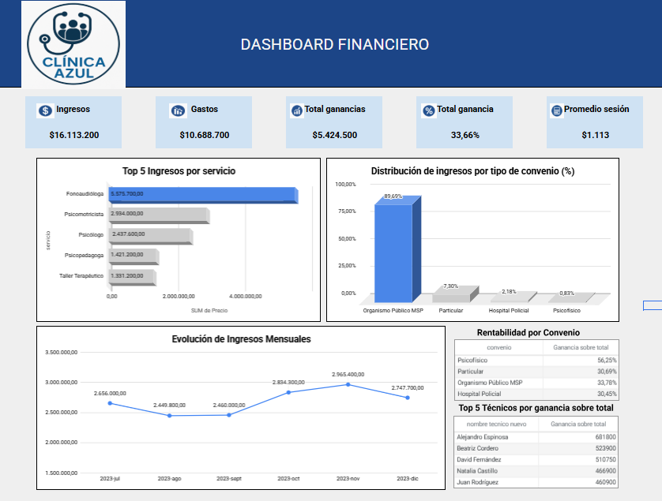
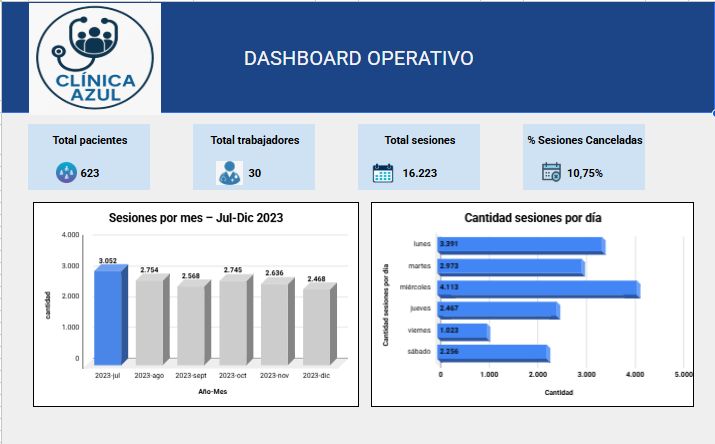
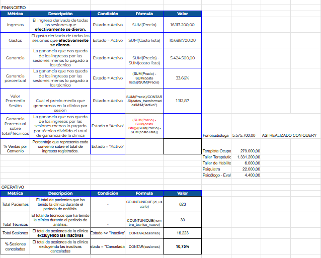
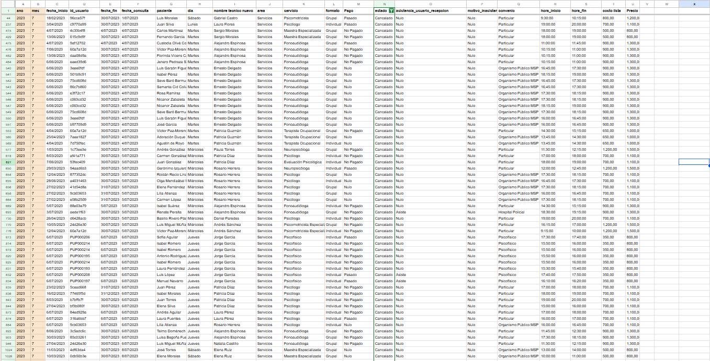

# Dashboard Financiero y Operativo - Clínica Azul

## Descripción
Proyecto realizado en Google Sheets para analizar el desempeño financiero y operativo de una clínica.  
El dashboard permite visualizar ingresos, gastos, ganancias, sesiones, pacientes, trabajadores y cancelaciones.

## Objetivo
Crear un dashboard que facilite el seguimiento de indicadores clave de una clínica, apoyando la toma de decisiones en áreas financieras y operativas.

## Herramientas utilizadas
- Google Sheets
- Tablas dinámicas
- Fórmulas
- Gráficos
- Limpieza y transformación de datos

## Dashboards desarrollados

### Dashboard financiero
Incluye indicadores como:
- Ingresos totales
- Gastos
- Ganancia total
- Porcentaje de ganancia
- Promedio por sesión
- Top 5 ingresos por servicio
- Distribución de ingresos por convenio
- Evolución mensual de ingresos
- Rentabilidad por convenio
- Técnicos con mayor ganancia

### Dashboard operativo
Incluye indicadores como:
- Total de pacientes
- Total de trabajadores
- Total de sesiones
- Porcentaje de sesiones canceladas
- Sesiones por mes
- Cantidad de sesiones por día

## Proceso realizado
- Organización de datos clínicos y financieros.
- Transformación de datos para análisis.
- Creación de tablas auxiliares.
- Definición de métricas clave.
- Construcción de dashboards visuales.
- Documentación de indicadores y fórmulas utilizadas.

## Vista de documentación

## Datos transformados

## Proyecto interactivo
Puedes ver el dashboard completo en Google Sheets aquí:

[Ver dashboard en Google Sheets](https://docs.google.com/spreadsheets/d/1V-emxXzN3Fix2hrgV7EbgeFRWeefN0FO6-apdnO-CTw/edit?usp=sharing)

## Insights principales
- Se identificaron los servicios con mayor generación de ingresos.
- Se analizó la rentabilidad por tipo de convenio.
- Se evaluó la evolución mensual de ingresos.
- Se midió el volumen operativo mediante sesiones, pacientes y cancelaciones.
- Se identificaron técnicos con mayor ganancia generada.

## Conclusión
Este proyecto demuestra el uso de Google Sheets para crear dashboards financieros y operativos, transformar datos y comunicar indicadores clave para la toma de decisiones.
